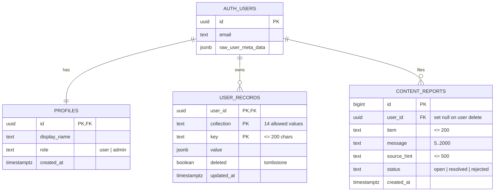

# Data Model

Sirat Path stores data in three places:

| Layer | Technology | Contents | Required? |
|---|---|---|---|
| Device: records | IndexedDB via Dexie (`src/lib/db.ts`) | All personal app data | Yes (always) |
| Device: preferences | `localStorage` key `sirat-settings` (`src/lib/settings.ts`) | Settings, location | Yes (always) |
| Cloud | Supabase Postgres (`supabase/schema.sql`) | Account, synced copy of the above, content reports | Only when signed in |

Read-only content (Quran, hadith, tafsir) is **not** user data. It is bundled (`public/data/quran.json`) or fetched and cached by the service worker.

## 1. Cloud schema (Supabase)

### Tables

**`profiles`**: one row per user, created by the `on_auth_user_created` trigger. `display_name` defaults to the OAuth name or the part of the email before the @.

**`user_records`**: a single generic table for all synced data. The key is `(user_id, collection, key)` and the row holds a JSON `value`.

- Allowed `collection` values: `bookmarks, notes, reads, khatm, dhikr, salah, azkar, journal, habits, habitLog, learn, ramadan, saved, settings`.
- `deleted = true` is a tombstone, so deletions sync across devices.
- Index: `(user_id, updated_at)` for incremental pulls.

**`content_reports`**: user-filed corrections for religious content, reviewed on `/admin`.

### Functions

| Function | Purpose |
|---|---|
| `handle_new_user()` | Trigger that creates the profile on sign-up |
| `is_admin()` | `true` if the caller's profile role is `admin` (used in policies) |
| `my_role()` | The caller's current role; stops users from promoting themselves |
| `delete_my_account()` | Deletes the caller's `auth.users` row; data cascades |

### Deletion behaviour

- Deleting a user cascades to `profiles` and `user_records`.
- `content_reports.user_id` is set to `NULL`. The report is kept for the correction record but is no longer linked to the person.

## 2. Device schema (Dexie / IndexedDB)

Defined in `src/lib/db.ts`. Each table maps one to one onto a `user_records.collection`:

| Table | Holds |
|---|---|
| `bookmarks` | Bookmarked ayahs |
| `notes` | Personal notes on ayahs |
| `reads` | Daily reading counts, keyed by day (goal ring, insights heatmap) |
| `khatm` | Khatm (completion) plans |
| `dhikr` | Tasbih sessions and lifetime counts |
| `salah` | Daily prayer log (on time / jamaʿah / late / missed) |
| `azkar` | Morning and evening azkar completion |
| `journal` | Private reflection entries |
| `habits`, `habitLog` | Habit definitions and daily ticks |
| `learn` | Course and lesson progress, quiz results |
| `ramadan` | 30-day Ramadan tracker |
| `saved` | Saved duas and hadith (`kind`, `id`, `ref`) |

Tables with auto-increment IDs get a device-independent `syncKey`, so records from two devices don't collide.

## 3. Preferences (`sirat-settings`)

This is the `Settings` type in `src/lib/settings.ts`. It syncs as one record (`collection = 'settings'`, `key = 'prefs'`). It includes:

- theme, accent and UI language
- reader options: translation mode, `urduId`, tajweed, read mode
- `hadithLang` (`en | ur | both`)
- reciter, playback rate and repeat
- prayer method, madhab and per-prayer adjustments
- `location` (latitude, longitude, label)
- reminders and adhan
- daily goal and last-read position

On pull, a device keeps its **own** location if it has one, so a phone and a laptop in different cities don't overwrite each other.

Other `localStorage` keys: `sirat-device` (device id), `sirat-last-sync`, `sirat-offline` (downloaded offline packs), `sirat-tafsir`, `sirat-kids-stars`, `sp-install-dismissed`.

## 4. Sync algorithm (`src/lib/cloud.ts`)

1. **Pull:** fetch rows where `updated_at > last-sync`, then apply them using last-write-wins. Tombstones delete local records.
2. **Push:** hash each local record. Upsert only the records whose hash changed since the last push.
3. Save the new `sirat-last-sync`.

Sync runs on sign-in, app start, focus, reconnect, every few minutes and shortly after local edits (debounced).

## 5. Read-only content sources

| Content | Format | Source |
|---|---|---|
| Quran Arabic, English, metadata | `public/data/quran.json`, built from `data-src/` | Tanzil (bundled, precached) |
| Urdu translations, tafsir, word-by-word, tajweed | JSON per chapter | api.quran.com v4 (cached) |
| Hadith (Arabic, English, Urdu) | JSON per section | hadith-api via jsDelivr, with a GitHub raw fallback (cached) |
| Duas, courses, Hajj guide | TypeScript in `src/content/` | Written for the project, with references |
