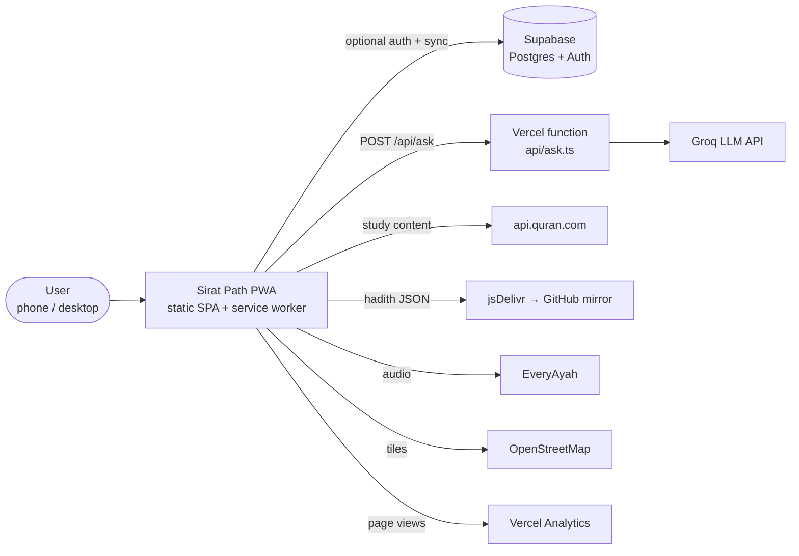
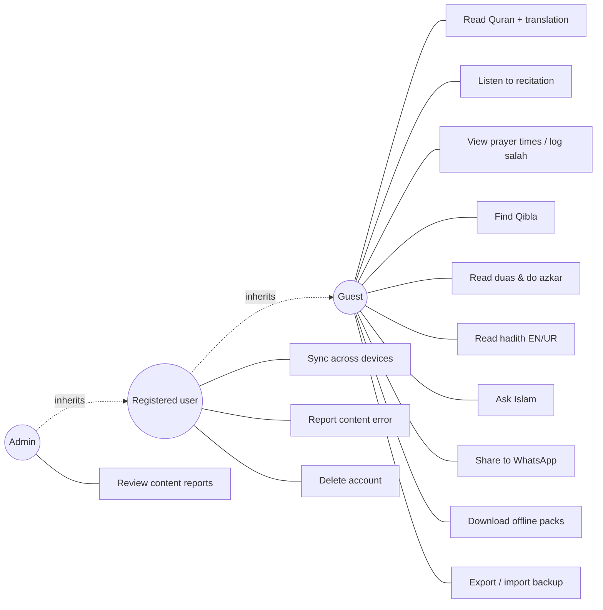
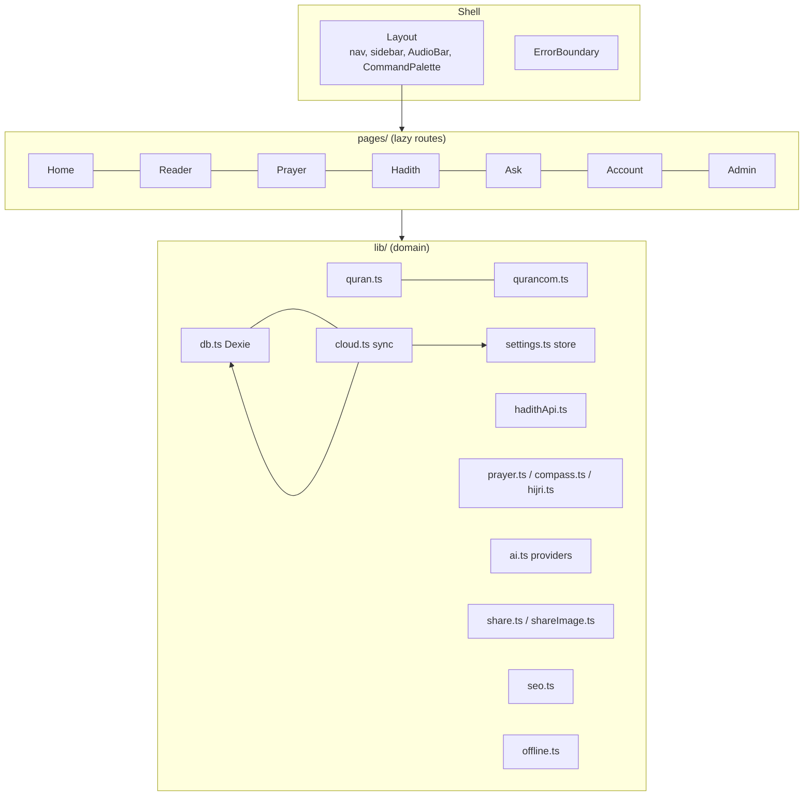
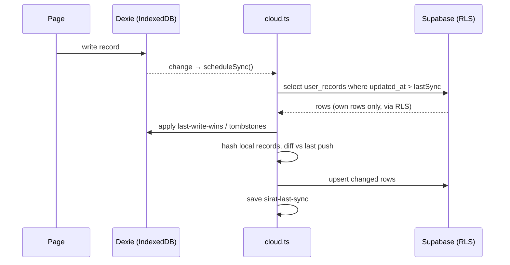
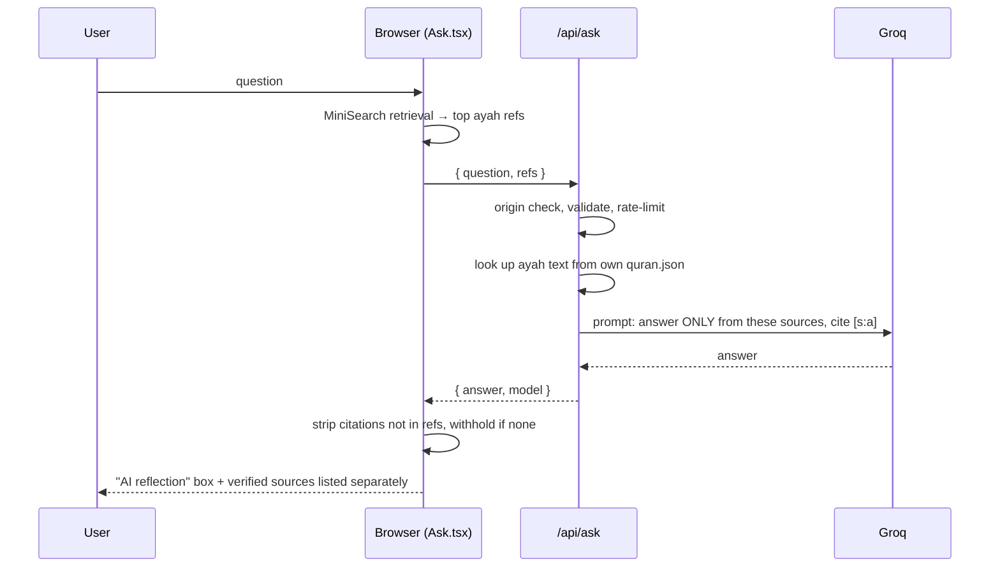
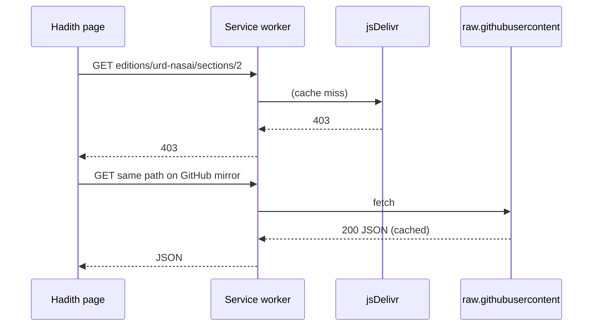

# Design Document: Sirat Path

This document covers system design (use cases, components, sequences) and UI design. The data design is in [DATA_MODEL.md](DATA_MODEL.md), and the high-level architecture is in [ARCHITECTURE.md](ARCHITECTURE.md).

## 1. System context

## 2. Use cases

### Key use case descriptions

**UC3: View prayer times and log a salah**

- **Actor:** Guest.
- **Precondition:** a location is set (GPS or a chosen city).
- **Main flow:**
  1. The user opens Salah.
  2. The system calculates times on the device and highlights the next prayer.
  3. The user taps a prayer and picks a status.
  4. The system saves it to IndexedDB and updates the 7-day history.
- **Alternate flow:** no location, so the system shows the location picker.
- **Postcondition:** the log persists offline. If the user is signed in, it syncs.

**UC6: Read hadith in Urdu**

- **Actor:** Guest.
- **Main flow:**
  1. Hadith → collection → book.
  2. The system fetches the English and Arabic editions through `hadithFetch` (jsDelivr first, then GitHub).
  3. The user selects اردو. The system fetches the Urdu edition and matches it by hadith number.
  4. Each card shows the Arabic, then the Urdu, and the grades.
- **Alternate flows:**
  - The Urdu edition fails to load, so a notice appears and English is shown.
  - A hadith is missing from the Urdu edition, so English is shown for that card.

**UC7: Ask Islam (Cloud mode)**

- **Actor:** Guest.
- **Main flow:** see the sequence diagram in §4.2.
- **Exception flows:**
  - No relevant ayahs, so the system answers "not enough reliable sources".
  - Groq rate limit, so the fallback model is tried.
  - Still failing, so the system shows sources only.

**UC8: Share to WhatsApp**

- **Main flow:**
  1. The user taps Share on an ayah, hadith or dua.
  2. The system builds the message (text, reference, deep link).
  3. On mobile, it opens `whatsapp://send`. On desktop, it opens WhatsApp Web.
  4. The user returns and the app is unchanged.
- **Alternate flow:** the WhatsApp app isn't installed. After 1.8 s the system falls back to wa.me.

## 3. Component design

**Design patterns**

| Pattern | Where it's used |
|---|---|
| **Provider / strategy** | `AIProvider`, implemented as `NoAI`, `FreeRemote` and `Local` (WebLLM in a worker) |
| **External store** | `settings.ts` and `offline.ts` use `useSyncExternalStore`, so they're hydration-safe and synchronous |
| **Repository** | `db.ts` hides IndexedDB. `cloud.ts` mirrors it to Supabase without the pages knowing |
| **Fallback chain** | `hadithFetch` (CDN → GitHub), Groq model list, AI mode → sources-only |
| **Cache-first / stale-while-revalidate** | Workbox `runtimeCaching` rules for each remote origin |

## 4. Sequence diagrams

### 4.1 Cloud sync

### 4.2 Ask Islam (grounded AI)

### 4.3 Hadith load with mirror fallback

## 5. UI design

### 5.1 Principles

- **Calm and reverent:** soft surfaces, generous spacing, Arabic set large in Amiri Quran, and Urdu in Noto Nastaliq.
- **Mobile-first:** a bottom navigation (Home, Quran, Salah, Duas, More), with sheets for options. On desktop, a sidebar layout and a command palette (Ctrl+K).
- **Sources are always visible:** every ayah, hadith and dua shows its reference chip.
- **Inclusive:** the layout mirrors fully in RTL for Urdu and Arabic, and tap targets are at least 40 px.

### 5.2 Design tokens

These are defined in `src/index.css` as CSS variables and switched by `data-theme` and `data-accent`:

| Token | Use |
|---|---|
| `--bg`, `--surface`, `--surface-2` | Page and card backgrounds |
| `--ink`, `--muted`, `--line` | Text and borders |
| `--brand`, `--brand-ink`, `--gold` | Accent colours (Emerald, Lavender, Teal themes) |
| `--hero-a`, `--hero-b` | Gradient for the home hero |

Fonts: **Inter** (UI), **Amiri Quran** (Arabic), **Noto Nastaliq Urdu** (Urdu).

### 5.3 Screen inventory

There are 35 routes, defined in `src/App.tsx`.

| Area | Screens |
|---|---|
| Core | Today (`/`), Quran list, Reader, Search, Salah, Qibla, Duas, Azkar, Tasbih, Hadith (collection → book → hadith) |
| Study | Ask, Learn (course → lesson), Library, 99 Names, Calendar |
| Practice | Khatm, Ramadan, Zakat, Hajj, Habits, Journal, Insights, Kids, Saved |
| System | Account, Admin, Settings, More, About, 404 |

Screenshots of every route at 390 px and 1440 px are produced by `npm run test:e2e` in `tests/screens/`.

### 5.4 Key UI components (`src/components`)

| Component | Role |
|---|---|
| `ui.tsx` | Primitives: `PageHeader`, `Sheet` (portal), `Tabs`, `Ring`, `Empty` |
| `Layout` | Navigation shell, theme, RTL |
| `AudioBar` | Persistent recitation player |
| `WhatsAppButton` | Green share pill, used on every shareable item |
| `InstallBanner` | Install prompt plus share invitation |
| `ReportButton` | Content-error reporting (Supabase or GitHub) |
| `SalahTracker`, `QiblaMap`, `LocationPicker` | Feature widgets |
